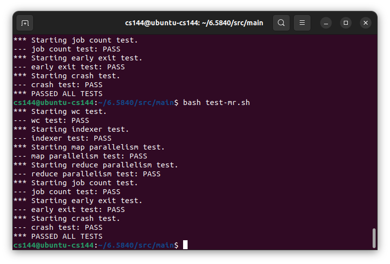

Source: [65840 Lab1](https://pdos.csail.mit.edu/6.824/labs/lab-mr.html)

Thank you for accessing my study path.

These are my study records of MIT 65840, a renowned distributed systems course. I will **NOT** share any code due to the student code and policy. Instead, I will share my thoughts and the possible solutions I have found. The accuracy of my solutions is not guaranteed. I hope you enjoy my sharing. 

## 1. Overview of this task

For the first lab of MIT 65840, the MapReduce implementation task is concise and understandable. All I did was watch the first several courses, read the lab page, and the MapReduce paper.

For those with little coding experience or basic knowledge in C, Java, or Python, Go courses are highly recommended. For learners who can read or understand Chinese, a helpful video from [bilibili](https://www.bilibili.com/video/BV1HW4y1n7BF) and the official [Go tutorial](https://go.dev/doc/tutorial/) are recommended. Despite having ZERO Go experience before taking this course, I was able to complete the lab after studying these materials.

For those who really CAN NOT find **any possible solutions**, just like me, this [video](https://www.bilibili.com/video/BV1mF411J7tH/?share_source=copy_web&vd_source=30a004cc68fcb997cec4043e4e5862c7) published by 郭郭wg, aa knowledgeable bilibili content creator, may save you time and frustration. It could help you better understand what RPC and MapReduce are. I learned a lot from these courses. He did not share his code either, but the insights gained are valuable.

## 2. Other Hint for this Lab 

The *A few rules* and *Hints* parts are essential for finishing this section. These instructions can assist you whenever you encounter obstacles.

The ExampleCall is a useful tool for understanding data transmission between the Coordinator and worker.

## 3. Before Starting Programming

Please ensure that you have read the [Map-Reduce paper](https://static.googleusercontent.com/media/research.google.com/en//archive/mapreduce-osdi04.pdf).

## 4. The Structure I used
Since the lab provides a detailed structure, all I need to do is build an RPC task and a reasonable Coordinator.

The coordinator contains two channels: one for Map tasks and another for Reduce tasks. Additionally, a map named TaskConditionMap, which records the progress of all tasks, is needed.

## 5. Dummy Solution for Time Checker

*All the dummy solutions I provided, as mentioned, may seem silly (but they work!). I am 1000% sure that others would find better solutions, but that is all I got and used.*

To implement backup tasks and ensure that these backup plans can only be scheduled after a relatively long period of time, timestamps are assigned to all generated tasks. I compared all timestamps with the year 2000 to identify non-functional tasks, given that it is currently 2023. Only tasks with timestamps later than 2000 are considered to be working or worked.

## 6. Dummy Solution for Finish Signal

Another problem I encountered is informing the coordinator that a task has been successfully completed. One solution I adopted is using another `Call` method.

I wrote two `Call` functions for this task. The first one, named `Process`, is responsible for retrieving data and task requests from the coordinator. The other one, named `TaskDone`, notifies the coordinator when the task is finished, without considering any time limits.

**It is coordinator's job to determine whether the work is useful or not.**

## 7. Result

## 8. Doodle

It is definitely a simple task, but not that simple for me. I am glad I finished Lab1 and gained a deeper understanding of MapReduce. Currently, I am struggling with building Raft ＞﹏＜. I hope to share my own solutions for Lab2 soon and learn even more.
